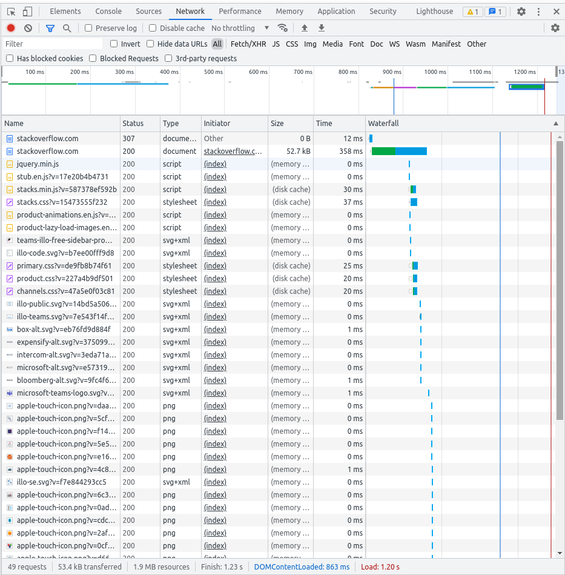

# Домашнее задание к занятию "3.6. Компьютерные сети, лекция 1"

---

Добрый день!  
Домашнее задание будет выполнено в виде ответов по пунктам.  
Ответы на вопросы выделены *курсивом*

---

1. Работа c HTTP через телнет.
- Подключитесь утилитой телнет к сайту stackoverflow.com
- В ответе укажите полученный HTTP код, что он означает?

    >HTTP/1.1 301 Moved Permanently

    *Код 301 означает, что страница была перемещена на другой адрес, подробности в поле location*

    >location: https://stackoverflow.com/questions

2. Повторите задание 1 в браузере, используя консоль разработчика F12.
- откройте вкладку `Network`
- отправьте запрос http://stackoverflow.com
- найдите первый ответ HTTP сервера, откройте вкладку `Headers`
- укажите в ответе полученный HTTP код.

    ```
    HTTP/1.1 307 Internal Redirect
    Location: https://stackoverflow.com/
    Non-Authoritative-Reason: HSTS
    ```

- проверьте время загрузки страницы, какой запрос обрабатывался дольше всего?

    *Время загрузки 1.2 секунды. Самый долгий запрос первый `https://stackoverflow.com/` - 366 ms*

- приложите скриншот консоли браузера в ответ.

    

3. Какой IP адрес у вас в интернете?

    `$ dig +short myip.opendns.com @resolver1.opendns.com`

    >85.249.XXX.XXX

4. Какому провайдеру принадлежит ваш IP адрес? Какой автономной системе AS? Воспользуйтесь утилитой `whois`

    `whois -h whois.radb.net 85.249.XXX.XXX`

    ```
    route:          85.249.108.0/22
    descr:          PJSC VimpelCom
    origin:         AS34038
    mnt-by:         AS3216-MNT
    mnt-by:         RU-CORBINA-MNT
    created:        2019-10-29T15:20:51Z
    last-modified:  2019-10-29T15:20:51Z
    source:         RIPE
    ```

5. Через какие сети проходит пакет, отправленный с вашего компьютера на адрес 8.8.8.8? Через какие AS? Воспользуйтесь утилитой `traceroute`

    ```
    traceroute to 8.8.8.8 (8.8.8.8), 30 hops max, 60 byte packets
     1  192.168.10.1 [*]  0.672 ms  0.773 ms  0.679 ms
     2  217.195.208.92 [AS34038]  1.527 ms  1.578 ms  1.518 ms
     3  217.195.211.97 [AS34038]  3.007 ms  2.943 ms  2.858 ms
     4  82.142.167.245 [AS8350/AS3216]  2.794 ms  2.940 ms  2.874 ms
     5  79.104.235.213 [AS3216]  31.378 ms 79.104.235.215 [AS3216]  31.635 ms 79.104.235.213 [AS3216]  35.201 ms
     6  72.14.213.116 [AS15169]  35.139 ms 81.211.29.103 [AS3216]  30.169 ms  30.254 ms
     7  108.170.250.113 [AS15169]  30.450 ms 108.170.250.34 [AS15169]  30.651 ms 108.170.250.113 [AS15169]  34.673 ms
     8  209.85.255.136 [AS15169]  48.777 ms 216.239.51.32 [AS15169]  48.035 ms 209.85.255.136 [AS15169]  51.761 ms
     9  72.14.238.168 [AS15169]  51.131 ms 209.85.254.20 [AS15169]  47.820 ms 172.253.65.82 [AS15169]  54.065 ms
    10  142.250.208.25 [AS15169]  45.671 ms 108.170.233.163 [AS15169]  47.842 ms 142.250.210.47 [AS15169]  48.715 ms
    11  * * *
    12  * * *
    13  * * *
    14  * * *
    15  * * *
    16  * * *
    17  * * *
    18  * * *
    19  * * *
    20  8.8.8.8 [AS15169]  48.530 ms  45.420 ms  50.836 ms
    ```

6. Повторите задание 5 в утилите `mtr`. На каком участке наибольшая задержка - delay?

    ```
                                  My traceroute  [v0.93]
    andrey-VirtualBox (192.168.10.1)                       2021-12-11T19:01:00+0500
    Keys:  Help   Display mode   Restart statistics   Order of fields   quit
                                             Packets               Pings
     Host                                  Loss%   Snt   Last   Avg  Best  Wrst StDev
     1. AS???    192.168.10.1               0.0%    87    1.7   1.0   0.6   2.2   0.3
     2. AS34038  217.195.208.92             0.0%    87    1.9   1.8   1.1  13.6   1.5
     3. AS34038  217.195.211.97             0.0%    87    2.2   2.6   1.7  11.8   1.8
     4. AS3216   194.186.39.93              0.0%    87    2.6   2.2   1.5   7.8   1.0
     5. AS???    79.104.235.213             0.0%    87   33.8  33.5  32.9  46.2   1.5
     6. AS15169  72.14.205.76               0.0%    87   37.2  37.6  36.1  48.2   2.4
     7. AS15169  108.170.250.51             3.4%    87   33.2  34.5  32.8  49.4   3.2
     8. AS15169  142.251.49.158            57.0%    87   44.8  45.3  44.2  57.2   2.1
     9. AS15169  216.239.57.222             0.0%    87   45.1  45.9  44.6  54.3   1.9
    10. AS15169  142.250.208.25             0.0%    87   45.3  46.1  44.9  54.1   1.3
    11. (waiting for reply)
    12. (waiting for reply)
    13. (waiting for reply)
    14. (waiting for reply)
    15. (waiting for reply)
    16. (waiting for reply)
    17. AS15169  8.8.8.8                   81.4%    86   46.0  44.5  44.1  46.0   0.5
    ```
    
    *На 5 хопе наибольшая задержка в данном случае от 194.186.39.93 до 79.104.235.213, внутри AS3216*

    `$ whois -h whois.ripe.net 79.104.235.213`

    ```
    route:          79.104.0.0/16
    descr:          EDN SOVINTEL
    origin:         AS3216
    mnt-by:         SOVINTEL-MNT
    created:        2008-12-11T08:32:08Z
    last-modified:  2008-12-11T08:32:08Z
    source:         RIPE # Filtered
    ```

    `$ whois -h whois.ripe.net AS3216`

    ```
    role:           Teleross NOC
    address:        111250  Russia Moscow, Krasnokazarmennaja, 12
    org:            ORG-ES15-RIPE
    admin-c:        SVNT1-RIPE
    tech-c:         SVNT2-RIPE
    nic-hdl:        TELE1-RIPE
    abuse-mailbox:  abuse-b2b@beeline.ru
    mnt-by:         AS3216-MNT
    remarks:        formely Sovam Teleport NOC
    created:        2002-05-27T14:37:41Z
    last-modified:  2021-09-24T07:14:32Z
    source:         RIPE # Filtered
    ```

7. Какие DNS сервера отвечают за доменное имя dns.google? Какие A записи? воспользуйтесь утилитой `dig`

    *Сервера, отвечающие за зону*

    `$ dig NS +short dns.google`

    ```
    ns1.zdns.google.
    ns2.zdns.google.
    ns4.zdns.google.
    ns3.zdns.google.
    ```

    `$ dig A +short dns.google`

    ```
    8.8.8.8
    8.8.4.4
    ```

    *Сервера 8.8.8.8 и 8.8.4.4 IN A*

8. Проверьте PTR записи для IP адресов из задания 7. Какое доменное имя привязано к IP? воспользуйтесь утилитой `dig`

    `dig +short -x 8.8.8.8`

    `dns.google.`

    `$ dig +short -x 8.8.4.4`

    `dns.google.`
