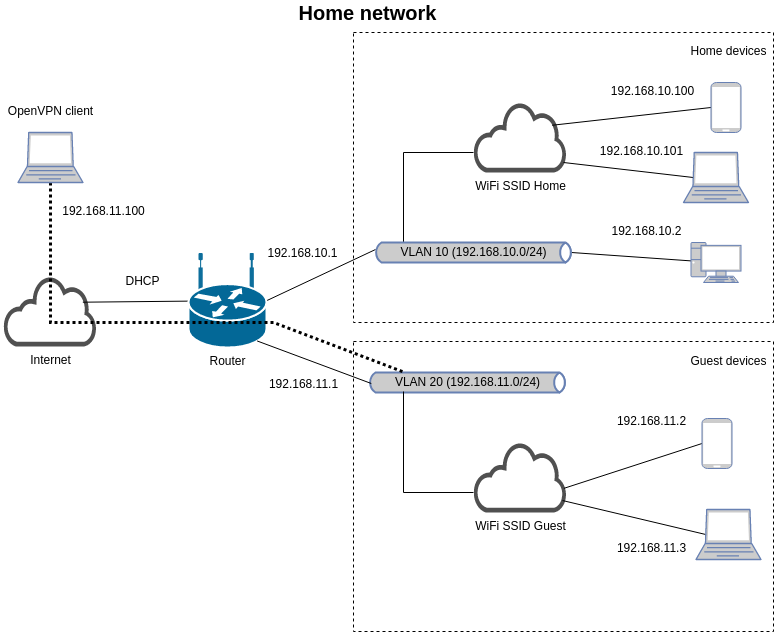

# Домашнее задание к занятию "3.8. Компьютерные сети, лекция 3"

---

Добрый день!  
Домашнее задание будет выполнено в виде ответов по пунктам.  
Ответы на вопросы выделены *курсивом*

---

1. Подключитесь к публичному маршрутизатору в интернет. Найдите маршрут к вашему публичному IP

    `$ dig +short myip.opendns.com @resolver1.opendns.com`

    >85.249.XXX.XXX

    `$ telnet route-views.routeviews.org`

    ```
    Trying 128.223.51.103...
    Connected to route-views.routeviews.org.
    Escape character is '^]'.
    ```

    `route-views>sh ip rou 85.249.XXX.XXX`

    ```
    Routing entry for 85.249.108.0/22
      Known via "bgp 6447", distance 20, metric 0
      Tag 2497, type external
      Last update from 202.232.0.2 4d23h ago
      Routing Descriptor Blocks:
      * 202.232.0.2, from 202.232.0.2, 4d23h ago
          Route metric is 0, traffic share count is 1
          AS Hops 3
          Route tag 2497
          MPLS label: none
    ```

    `route-views>sh ip bgp 85.249.XXX.XXX`
    
```
BGP routing table entry for 85.249.108.0/22, version 1400982974
Paths: (23 available, best #12, table default)
  Not advertised to any peer
  Refresh Epoch 1
  20912 3257 1273 3216 34038
    212.66.96.126 from 212.66.96.126 (212.66.96.126)
      Origin IGP, localpref 100, valid, external
      Community: 3257:8070 3257:30352 3257:50001 3257:53900 3257:53902 20912:65004
      path 7FE174597EA8 RPKI State not found
      rx pathid: 0, tx pathid: 0
  Refresh Epoch 1
  3549 3356 3216 34038
    208.51.134.254 from 208.51.134.254 (67.16.168.191)
      Origin IGP, metric 0, localpref 100, valid, external
      Community: 3216:2001 3216:4472 3356:2 3356:22 3356:100 3356:123 3356:503 3356:903 3356:2067 3549:2581 3549:30840
      path 7FE0ECF799C0 RPKI State not found
      rx pathid: 0, tx pathid: 0
  Refresh Epoch 1
  57866 3356 3216 34038
    37.139.139.17 from 37.139.139.17 (37.139.139.17)
      Origin IGP, metric 0, localpref 100, valid, external
      Community: 3216:2001 3216:4472 3356:2 3356:22 3356:100 3356:123 3356:503 3356:903 3356:2067
      path 7FE0D5917B00 RPKI State not found
      rx pathid: 0, tx pathid: 0
  Refresh Epoch 1
  20130 6939 3216 34038
    140.192.8.16 from 140.192.8.16 (140.192.8.16)
      Origin IGP, localpref 100, valid, external
      path 7FE18C6837E8 RPKI State not found
      rx pathid: 0, tx pathid: 0
  Refresh Epoch 1
  53767 14315 6453 6453 3356 3216 34038
    162.251.163.2 from 162.251.163.2 (162.251.162.3)
      Origin IGP, localpref 100, valid, external
      Community: 14315:5000 53767:5000
      path 7FE10527AB30 RPKI State not found
      rx pathid: 0, tx pathid: 0
  Refresh Epoch 1
  101 174 3216 34038
    209.124.176.223 from 209.124.176.223 (209.124.176.223)
      Origin IGP, localpref 100, valid, external
      Community: 101:20100 101:20110 101:22100 174:21101 174:22010
      Extended Community: RT:101:22100
      path 7FE0BD108A18 RPKI State not found
      rx pathid: 0, tx pathid: 0
  Refresh Epoch 1
  852 3356 3216 34038
    154.11.12.212 from 154.11.12.212 (96.1.209.43)
      Origin IGP, metric 0, localpref 100, valid, external
      path 7FE0CDB074C0 RPKI State not found
      rx pathid: 0, tx pathid: 0
  Refresh Epoch 1
  3333 1103 3216 34038
    193.0.0.56 from 193.0.0.56 (193.0.0.56)
      Origin IGP, localpref 100, valid, external
      Community: 3216:2001 3216:4472
      path 7FE162DF9710 RPKI State not found
      rx pathid: 0, tx pathid: 0
  Refresh Epoch 1
  3356 3216 34038
    4.68.4.46 from 4.68.4.46 (4.69.184.201)
      Origin IGP, metric 0, localpref 100, valid, external
      Community: 3216:2001 3216:4472 3356:2 3356:22 3356:100 3356:123 3356:503 3356:903 3356:2067
      path 7FE1491AD4D8 RPKI State not found
      rx pathid: 0, tx pathid: 0
  Refresh Epoch 1
  6939 3216 34038
    64.71.137.241 from 64.71.137.241 (216.218.252.164)
      Origin IGP, localpref 100, valid, external
      path 7FE14689FCB0 RPKI State not found
      rx pathid: 0, tx pathid: 0
  Refresh Epoch 1
  7660 2516 1273 3216 34038
    203.181.248.168 from 203.181.248.168 (203.181.248.168)
      Origin IGP, localpref 100, valid, external
      Community: 2516:1030 7660:9003
      path 7FE0E5F369B0 RPKI State not found
      rx pathid: 0, tx pathid: 0
  Refresh Epoch 1
  2497 3216 34038
    202.232.0.2 from 202.232.0.2 (58.138.96.254)
      Origin IGP, localpref 100, valid, external, best
      path 7FE1035DFE70 RPKI State not found
      rx pathid: 0, tx pathid: 0x0
  Refresh Epoch 3
  3303 3216 34038
    217.192.89.50 from 217.192.89.50 (138.187.128.158)
      Origin IGP, localpref 100, valid, external
      Community: 3216:2001 3216:4472 3303:1004 3303:1006 3303:1030 3303:3056
      path 7FE0F1F90E90 RPKI State not found
      rx pathid: 0, tx pathid: 0
  Refresh Epoch 1
  4901 6079 3356 3216 34038
    162.250.137.254 from 162.250.137.254 (162.250.137.254)
      Origin IGP, localpref 100, valid, external
      Community: 65000:10100 65000:10300 65000:10400
      path 7FE0C1F369E8 RPKI State not found
      rx pathid: 0, tx pathid: 0
  Refresh Epoch 1
  7018 3356 3216 34038
    12.0.1.63 from 12.0.1.63 (12.0.1.63)
      Origin IGP, localpref 100, valid, external
      Community: 7018:5000 7018:37232
      path 7FE0D9F22868 RPKI State not found
      rx pathid: 0, tx pathid: 0
  Refresh Epoch 1
  49788 12552 3216 34038
    91.218.184.60 from 91.218.184.60 (91.218.184.60)
      Origin IGP, localpref 100, valid, external
      Community: 12552:12000 12552:12100 12552:12101 12552:22000
      Extended Community: 0x43:100:1
      path 7FE153BF1D58 RPKI State not found
      rx pathid: 0, tx pathid: 0
  Refresh Epoch 1
  8283 3216 34038
    94.142.247.3 from 94.142.247.3 (94.142.247.3)
      Origin IGP, metric 0, localpref 100, valid, external
      Community: 3216:2001 3216:4472 8283:1 8283:101 65000:52254
      unknown transitive attribute: flag 0xE0 type 0x20 length 0x18
        value 0000 205B 0000 0000 0000 0001 0000 205B
              0000 0005 0000 0001 
      path 7FE0D63930B8 RPKI State not found
      rx pathid: 0, tx pathid: 0
  Refresh Epoch 1
  1221 4637 3216 34038
    203.62.252.83 from 203.62.252.83 (203.62.252.83)
      Origin IGP, localpref 100, valid, external
      path 7FE134D2D528 RPKI State not found
      rx pathid: 0, tx pathid: 0
  Refresh Epoch 1
  701 1273 3216 34038
    137.39.3.55 from 137.39.3.55 (137.39.3.55)
      Origin IGP, localpref 100, valid, external
      path 7FE12EFCCBE8 RPKI State not found
      rx pathid: 0, tx pathid: 0
  Refresh Epoch 1
  3257 3356 3216 34038
    89.149.178.10 from 89.149.178.10 (213.200.83.26)
      Origin IGP, metric 10, localpref 100, valid, external
      Community: 3257:8794 3257:30043 3257:50001 3257:54900 3257:54901
      path 7FE17B60E4A8 RPKI State not found
      rx pathid: 0, tx pathid: 0
  Refresh Epoch 1
  3561 3910 3356 3216 34038
    206.24.210.80 from 206.24.210.80 (206.24.210.80)
      Origin IGP, localpref 100, valid, external
      path 7FE14EC2AA60 RPKI State not found
      rx pathid: 0, tx pathid: 0
  Refresh Epoch 1
  1351 6939 3216 34038
    132.198.255.253 from 132.198.255.253 (132.198.255.253)
      Origin IGP, localpref 100, valid, external
      path 7FE13128A270 RPKI State not found
      rx pathid: 0, tx pathid: 0
  Refresh Epoch 1
  19214 174 3216 34038
    208.74.64.40 from 208.74.64.40 (208.74.64.40)
      Origin IGP, localpref 100, valid, external
      Community: 174:21101 174:22010
      path 7FE0B4F94E60 RPKI State not found
      rx pathid: 0, tx pathid: 0
```

*Выбран как лучший #12 из 23. AS2497 -> AS3216 -> AS34038*

```
    Refresh Epoch 1
      2497 3216 34038
        202.232.0.2 from 202.232.0.2 (58.138.96.254)
          Origin IGP, localpref 100, valid, external, best
          path 7FE1035DFE70 RPKI State not found
          rx pathid: 0, tx pathid: 0x0
```

2. Создайте dummy0 интерфейс в Ubuntu. Добавьте несколько статических маршрутов. Проверьте таблицу маршрутизации.

    *Создаем интерфейс dummy0, назначаем адрес 10.10.10.1/24, поднимаем интерфейс*

    ```
    $ sudo ip link add dummy0 type dummy
    $ sudo ip add add 10.10.10.1/24 dev dummy0
    $ sudo ip link set dummy0 up
    ```

    *Проверяем*

    `$ ip -br addr`

    ```
    lo               UNKNOWN        127.0.0.1/8 ::1/128 
    eth0             UP             10.0.2.15/24 fe80::a00:27ff:fe73:60cf/64 
    eth0.10@eth0     UP             10.0.10.2/24 fe80::a00:27ff:fe73:60cf/64 
    dummy0           UNKNOWN        10.10.10.1/24 fe80::9460:b1ff:feec:9898/64 
    ```

    `$ ping 10.10.10.1`

    ```
    PING 10.10.10.1 (10.10.10.1) 56(84) bytes of data.
    64 bytes from 10.10.10.1: icmp_seq=1 ttl=64 time=0.075 ms
    64 bytes from 10.10.10.1: icmp_seq=2 ttl=64 time=0.076 ms
    64 bytes from 10.10.10.1: icmp_seq=3 ttl=64 time=0.077 ms
    ```

    *Добавим несколько статических маршрутов через интерфейс eth0.10 vlan 10, созданный ранее в работе 3.7*

    ```
    $ sudo ip r add 10.10.20.0/24 via 10.0.10.1
    $ sudo ip r add 10.10.30.0/24 via 10.0.10.1
    $ sudo ip r add 10.10.40.0/24 via 10.0.10.1
    ```

    *Проверяем таблицу маршрутизации*

    `$ ip r`

    ```
    default via 10.0.2.2 dev eth0 proto dhcp src 10.0.2.15 metric 100 
    10.0.2.0/24 dev eth0 proto kernel scope link src 10.0.2.15 
    10.0.2.2 dev eth0 proto dhcp scope link src 10.0.2.15 metric 100 
    10.0.10.0/24 dev eth0.10 proto kernel scope link src 10.0.10.2 
    10.10.10.0/24 dev dummy0 proto kernel scope link src 10.10.10.1 
    10.10.20.0/24 via 10.0.10.1 dev eth0.10 
    10.10.30.0/24 via 10.0.10.1 dev eth0.10 
    10.10.40.0/24 via 10.0.10.1 dev eth0.10
    ```

    *Для того, чтобы конфигурация стала перманентной*

    `# echo "dummy" >> /etc/modules`

    `$ sudo nano /etc/network/interfaces`

    ```
    auto dummy0
    iface dummy0 inet static
      address 10.10.10.1/24
      pre-up ip link add dummy0 type dummy
      post-down ip link del dummy0
    
    #static routes
    up ip ro add 10.10.20.0/24 via 10.0.10.1
    up ip ro add 10.10.30.0/24 via 10.0.10.1
    up ip ro add 10.10.40.0/24 via 10.0.10.1
    ```

3. Проверьте открытые TCP порты в Ubuntu, какие протоколы и приложения используют эти порты? Приведите несколько примеров.

    *Список прослушиваемых TCP портов с указанием процессов, номера вместо имен сервисов, краткий вывод*

    `$ sudo ss -ltpnO`

    ```
    State         Recv-Q        Send-Q               Local Address:Port                Peer Address:Port        Process                                                          
    LISTEN        0             4096                 127.0.0.53%lo:53                       0.0.0.0:*            users:(("systemd-resolve",pid=617,fd=13))                       
    LISTEN        0             128                        0.0.0.0:22                       0.0.0.0:*            users:(("sshd",pid=1022,fd=3))                                  
    LISTEN        0             4096                       0.0.0.0:111                      0.0.0.0:*            users:(("rpcbind",pid=615,fd=4),("systemd",pid=1,fd=45))        
    LISTEN        0             128                           [::]:22                          [::]:*            users:(("sshd",pid=1022,fd=4))                                  
    LISTEN        0             4096                          [::]:111                         [::]:*            users:(("rpcbind",pid=615,fd=6),("systemd",pid=1,fd=47)) 
    ```

    *Слушаются порты*  
    - *53 на локалхосте PID 617 systemd-resolve. Протокол DNS*  
    - *22 на всех интерфейсах демон sshd PID 1022. Протокол SSH*  
    - *111 на всех интерфейсах демон rpcbind PID 615. Протокол RPC*

4. Проверьте используемые UDP сокеты в Ubuntu, какие протоколы и приложения используют эти порты?

    *Список прослушиваемых UDP портов с указанием процессов, номера вместо имен сервисов, краткий вывод*

    `$ sudo ss -lupnO`

    ```
    State         Recv-Q        Send-Q                 Local Address:Port                 Peer Address:Port        Process                                                          
    UNCONN        0             0                      127.0.0.53%lo:53                        0.0.0.0:*            users:(("systemd-resolve",pid=617,fd=12))                       
    UNCONN        0             0                     10.0.2.15%eth0:68                        0.0.0.0:*            users:(("systemd-network",pid=398,fd=19))                       
    UNCONN        0             0                            0.0.0.0:111                       0.0.0.0:*            users:(("rpcbind",pid=615,fd=5),("systemd",pid=1,fd=46))        
    UNCONN        0             0                               [::]:111                          [::]:*            users:(("rpcbind",pid=615,fd=7),("systemd",pid=1,fd=48))   
    ```

    *Слушаются порты*  
    - *53 на локалхосте PID 617 systemd-resolve. Протокол DNS*  
    - *68 на 10.0.2.15 демон systemd-network PID 398. Протокол BOOTPC*  
    - *111 на всех интерфейсах демон rpcbind PID 615. Протокол RPC*
    
5. Используя diagrams.net, создайте L3 диаграмму вашей домашней сети или любой другой сети, с которой вы работали. 

    