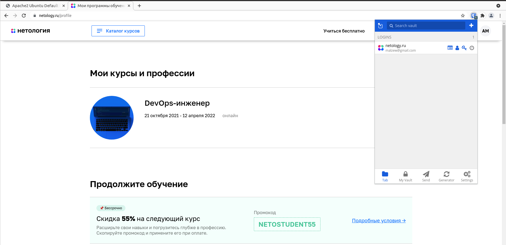
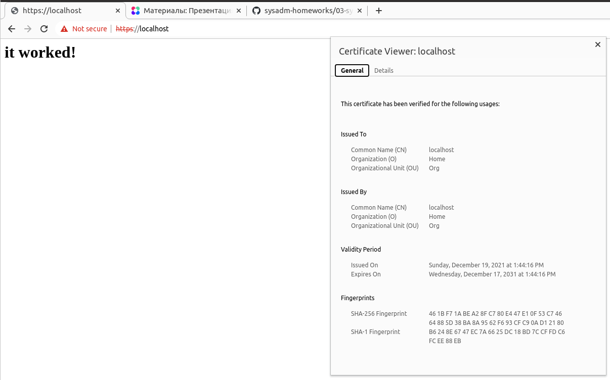
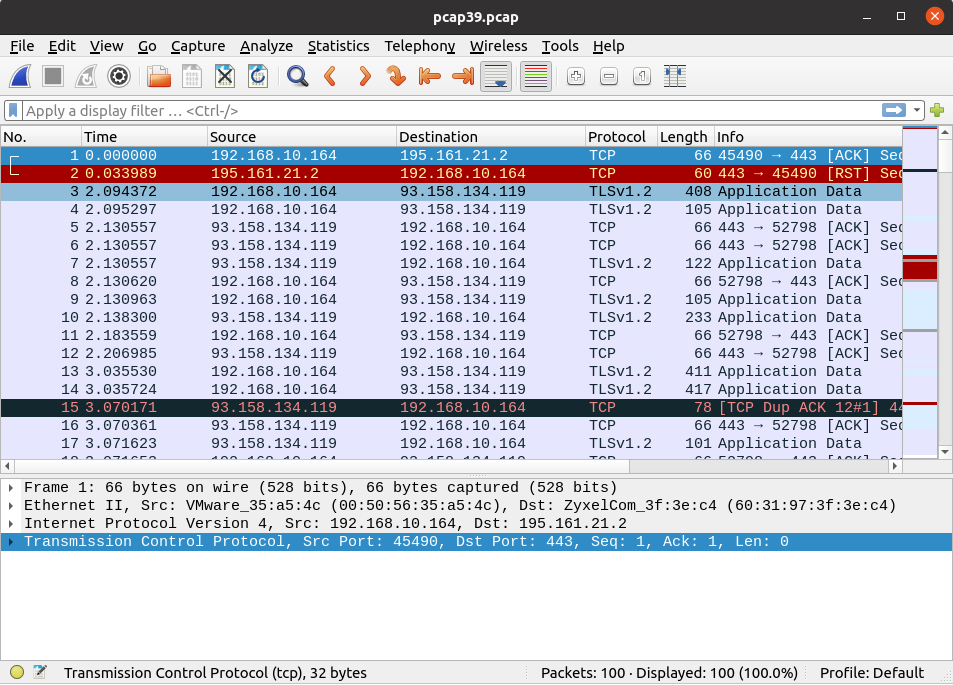

# Домашнее задание к занятию "3.9. Элементы безопасности информационных систем"

---

Добрый день!  
Домашнее задание будет выполнено в виде ответов по пунктам  
Ответы на вопросы выделены *курсивом*

---

1. Установите Bitwarden плагин для браузера. Зарегестрируйтесь и сохраните несколько паролей.

    

    *Выполнено*

2. Установите Google authenticator на мобильный телефон. Настройте вход в Bitwarden акаунт через Google authenticator OTP.

    *Выполнено*

3. Установите apache2, сгенерируйте самоподписанный сертификат, настройте тестовый сайт для работы по HTTPS.

    
    `$ sudo apt install apache2`

    `$ sudo a2enmod ssl`

    `$ sudo systemctl restart apache2`

    `$ sudo openssl req -x509 -nodes -days 3650 -newkey rsa:2048 -keyout /etc/ssl/private/apache-selfsigned.key -out /etc/ssl/certs/apache-selfsigned.crt -subj "/C=RU/ST=Tyumen/L=Tyumen/O=Home/OU=Org/CN=localhost"`

    `$ sudo nano /etc/apache2/sites-available/localhost.conf`

    ```
    <VirtualHost *:443>
        ServerName localhost
        DocumentRoot /var/www/localhost
        SSLEngine on
        SSLCertificateFile /etc/ssl/certs/apache-selfsigned.crt
        SSLCertificateKeyFile /etc/ssl/private/apache-selfsigned.key
    </VirtualHost>
    ```

    `$ sudo mkdir /var/www/localhost`

    `$ sudo nano /var/www/localhost/index.html`

    ```
    <h1>it worked!</h1>
    ```

    `$ sudo a2ensite localhost`

    `$ sudo apache2ctl configtest`

    `$ sudo systemctl reload apache2`

    

4. Проверьте на TLS уязвимости произвольный сайт в интернете (кроме сайтов МВД, ФСБ, МинОбр, НацБанк, РосКосмос, РосАтом, РосНАНО и любых госкомпаний, объектов КИИ, ВПК ... и тому подобное).

    *Проверим только что созданный свой сайт, его точно можно*

    `$ git clone --depth 1 https://github.com/drwetter/testssl.sh.git`

    `$ cd testssl.sh/`

    `$ ./testssl.sh -U --sneaky https://localhost`

```
###########################################################
    testssl.sh       3.1dev from https://testssl.sh/dev/
    (2201a28 2021-12-13 18:24:34 -- )

      This program is free software. Distribution and
             modification under GPLv2 permitted.
      USAGE w/o ANY WARRANTY. USE IT AT YOUR OWN RISK!

       Please file bugs @ https://testssl.sh/bugs/

###########################################################

 Using "OpenSSL 1.0.2-chacha (1.0.2k-dev)" [~183 ciphers]
 on andrey-VirtualBox:./bin/openssl.Linux.x86_64
 (built: "Jan 18 17:12:17 2019", platform: "linux-x86_64")


 Start 2021-12-19 14:05:52        -->> 127.0.0.1:443 (localhost) <<--

 A record via:           /etc/hosts 
 rDNS (127.0.0.1):       --
 Service detected:       HTTP


 Testing vulnerabilities 

 Heartbleed (CVE-2014-0160)                not vulnerable (OK), no heartbeat extension
 CCS (CVE-2014-0224)                       not vulnerable (OK)
 Ticketbleed (CVE-2016-9244), experiment.  not vulnerable (OK)
 ROBOT                                     not vulnerable (OK)
 Secure Renegotiation (RFC 5746)           supported (OK)
 Secure Client-Initiated Renegotiation     not vulnerable (OK)
 CRIME, TLS (CVE-2012-4929)                not vulnerable (OK)
 BREACH (CVE-2013-3587)                    no gzip/deflate/compress/br HTTP compression (OK)  - only supplied "/" tested
 POODLE, SSL (CVE-2014-3566)               not vulnerable (OK)
 TLS_FALLBACK_SCSV (RFC 7507)              No fallback possible (OK), no protocol below TLS 1.2 offered
 SWEET32 (CVE-2016-2183, CVE-2016-6329)    not vulnerable (OK)
 FREAK (CVE-2015-0204)                     not vulnerable (OK)
 DROWN (CVE-2016-0800, CVE-2016-0703)      not vulnerable on this host and port (OK)
                                           make sure you don't use this certificate elsewhere with SSLv2 enabled services
                                           https://censys.io/ipv4?q=461BF71ABEA28FC780E447E10F53C74664885D38BA8A9562F693CFC90AD12180 could help you to find out
 LOGJAM (CVE-2015-4000), experimental      common prime with 2048 bits detected: RFC3526/Oakley Group 14 (2048 bits),
                                           but no DH EXPORT ciphers
 BEAST (CVE-2011-3389)                     not vulnerable (OK), no SSL3 or TLS1
 LUCKY13 (CVE-2013-0169), experimental     potentially VULNERABLE, uses cipher block chaining (CBC) ciphers with TLS. Check patches
 Winshock (CVE-2014-6321), experimental    not vulnerable (OK)
 RC4 (CVE-2013-2566, CVE-2015-2808)        no RC4 ciphers detected (OK)


 Done 2021-12-19 14:06:18 [  28s] -->> 127.0.0.1:443 (localhost) <<--
```

5. Установите на Ubuntu ssh сервер, сгенерируйте новый приватный ключ. Скопируйте свой публичный ключ на другой сервер. Подключитесь к серверу по SSH-ключу.

    *На сервере*

    `$ sudo apt install openssh-server`

    `$ sudo systemctl status sshd`

    ```
    ● ssh.service - OpenBSD Secure Shell server
         Loaded: loaded (/lib/systemd/system/ssh.service; enabled; vendor preset: e>
         Active: active (running) since Sun 2021-12-19 14:22:56 +05; 6min ago
           Docs: man:sshd(8)
                 man:sshd_config(5)
       Main PID: 47535 (sshd)
          Tasks: 1 (limit: 9468)
         Memory: 1.1M
         CGroup: /system.slice/ssh.service
                 └─47535 sshd: /usr/sbin/sshd -D [listener] 0 of 10-100 startups
    ```

    *На клиенте*

    `$ ssh-keygen`

    `$ ssh-copy-id andrey@192.168.10.164`

    `$ ssh andrey@192.168.10.164`

    *Соглашаемся с сохранением ключей сервера, заходим в сессию.*

6. Переименуйте файлы ключей из задания 5. Настройте файл конфигурации SSH клиента, так чтобы вход на удаленный сервер осуществлялся по имени сервера.

    *На клиенте*

    ```
    $ mv ~/.ssh/id_rsa ~/.ssh/andrey_rsa
    $ mv ~/.ssh/id_rsa.pub ~/.ssh/andrey_rsa.pub
    ```
    
    `$ touch ~/.ssh/config && chmod 600 ~/.ssh/config`

    `$ nano ~/.ssh/config`

    ```
    Host ubuntu164
      HostName 192.168.10.164
      IdentityFile ~/.ssh/andrey_rsa
      User andrey
    ```

    `$ ssh ubuntu164`

    >andrey@andrey-VirtualBox:~$  

7. Соберите дамп трафика утилитой tcpdump в формате pcap, 100 пакетов. Откройте файл pcap в Wireshark.

    `$ sudo tcpdump -w pcap39.pcap -i ens33 -c 100 host 192.168.10.164`

    

 ---

## Задание для самостоятельной отработки (необязательно к выполнению)

8*. Просканируйте хост scanme.nmap.org. Какие сервисы запущены?

    `$ sudo nmap -A scanme.nmap.org`

```
Starting Nmap 7.80 ( https://nmap.org ) at 2021-12-19 15:03 +05
Nmap scan report for scanme.nmap.org (45.33.32.156)
Host is up (0.32s latency).
Other addresses for scanme.nmap.org (not scanned): 2600:3c01::f03c:91ff:fe18:bb2f
Not shown: 996 closed ports
PORT      STATE SERVICE    VERSION
22/tcp    open  ssh        OpenSSH 6.6.1p1 Ubuntu 2ubuntu2.13 (Ubuntu Linux; protocol 2.0)
| ssh-hostkey: 
|   1024 ac:00:a0:1a:82:ff:cc:55:99:dc:67:2b:34:97:6b:75 (DSA)
|   2048 20:3d:2d:44:62:2a:b0:5a:9d:b5:b3:05:14:c2:a6:b2 (RSA)
|   256 96:02:bb:5e:57:54:1c:4e:45:2f:56:4c:4a:24:b2:57 (ECDSA)
|_  256 33:fa:91:0f:e0:e1:7b:1f:6d:05:a2:b0:f1:54:41:56 (ED25519)
80/tcp    open  http       Apache httpd 2.4.7 ((Ubuntu))
|_http-server-header: Apache/2.4.7 (Ubuntu)
|_http-title: Go ahead and ScanMe!
9929/tcp  open  nping-echo Nping echo
31337/tcp open  tcpwrapped
Aggressive OS guesses: HP P2000 G3 NAS device (93%), Linux 2.6.32 (93%), Infomir MAG-250 set-top box (92%), Ubiquiti AirMax NanoStation WAP (Linux 2.6.32) (92%), Linux 2.6.32 - 3.13 (92%), Linux 3.3 (92%), Linux 2.6.32 - 3.1 (91%), Linux 3.7 (91%), Netgear RAIDiator 4.2.21 (Linux 2.6.37) (91%), Ubiquiti AirOS 5.5.9 (91%)
No exact OS matches for host (test conditions non-ideal).
Network Distance: 13 hops
Service Info: OS: Linux; CPE: cpe:/o:linux:linux_kernel

TRACEROUTE (using port 8888/tcp)
HOP RTT       ADDRESS
1   0.69 ms   _gateway (192.168.10.1)
2   1.16 ms   217.195.208.92
3   1.68 ms   217.195.211.97
4   2.00 ms   82.142.167.245
5   70.45 ms  mx01.Frankfurt.gldn.net (79.104.235.74)
6   78.16 ms  217.161.65.145
7   241.58 ms ae15-pcr1.ptl.cw.net (195.2.9.126)
8   223.35 ms et-7-1-0-xcr1.nyh.cw.net (195.2.24.241)
9   168.74 ms 195.2.31.5
10  224.57 ms ae1-xcr1.sje.cw.net (195.2.24.97)
11  217.55 ms ae13-xcr1.pal.cw.net (195.2.2.150)
12  213.61 ms linode-gw-xcr1.sje.cw.net (195.2.14.206)
13  217.12 ms scanme.nmap.org (45.33.32.156)

OS and Service detection performed. Please report any incorrect results at https://nmap.org/submit/ .
Nmap done: 1 IP address (1 host up) scanned in 49.20 seconds
```

    *Запущены:*

    - *22/tcp    open  ssh        OpenSSH 6.6.1p1 Ubuntu 2ubuntu2.13 (Ubuntu Linux; protocol 2.0)*  
    - *80/tcp    open  http       Apache httpd 2.4.7 ((Ubuntu))*  
    - *9929/tcp  open  nping-echo Nping echo*  
    - *31337/tcp open  tcpwrapped*

9*. Установите и настройте фаервол ufw на web-сервер из задания 3. Откройте доступ снаружи только к портам 22,80,443

    ```
    $ sudo ufw default deny incoming
    $ sudo ufw default allow outgoing
    $ sudo ufw allow 22
    $ sudo ufw allow 80
    $ sudo ufw allow 443
    $ sudo ufw enable
    ```

    `$ sudo ufw status verbose`

```
Status: active
Logging: on (low)
Default: deny (incoming), allow (outgoing), disabled (routed)
New profiles: skip

To                         Action      From
--                         ------      ----
22                         ALLOW IN    Anywhere                  
80                         ALLOW IN    Anywhere                  
443                        ALLOW IN    Anywhere                  
22 (v6)                    ALLOW IN    Anywhere (v6)             
80 (v6)                    ALLOW IN    Anywhere (v6)             
443 (v6)                   ALLOW IN    Anywhere (v6)             
```
