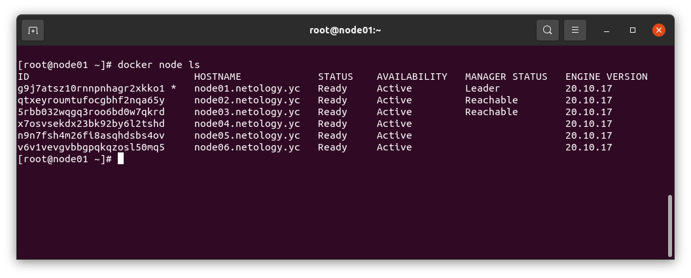
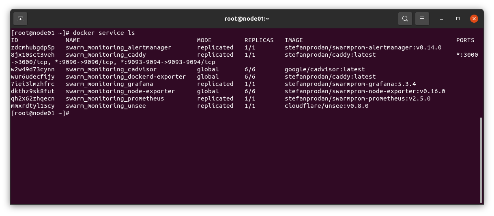

# Домашнее задание к занятию "5.5. Оркестрация кластером Docker контейнеров на примере Docker Swarm"

---

## Задача 1

Дайте письменые ответы на следующие вопросы:

- В чём отличие режимов работы сервисов в Docker Swarm кластере: replication и global?

*В режиме replication указывается количество индентичных сервисов, которое будет выполняться в кластере. Docker swarm сам их размещает по нодам, в зависомости от запрошенных и доступных ресурсов кластера.*

*В режиме global сервисы выполняются на каждой ноде в единственном экземпляре. Нет точно заданного числа сервисов на кластер. Каждый раз, при добавлении ноды в кластер, оркестратор добавляет такие сервисы на новую ноду. Хороший режим для агентов мониторинга, антивируса или других задач подобного рода.*

- Какой алгоритм выбора лидера используется в Docker Swarm кластере?

* Алоритм называется Raft.*

https://docs.docker.com/engine/swarm/how-swarm-mode-works/nodes/

- Что такое Overlay Network?

*Это тип сети для докер контейнеров. Она объеденяет контейнеры в единый vlan, тунеллированный поверх UDP c возможностью шифрования. Создает в каждом контейнере eth интерфейс с адресом из данной сети и релизует связность на 2 уровне между контейнерами. Подробнее:*

https://docs.docker.com/network/network-tutorial-overlay/

https://habr.com/ru/post/334004/

## Задача 2

Создать ваш первый Docker Swarm кластер в Яндекс.Облаке

Для получения зачета, вам необходимо предоставить скриншот из терминала (консоли), с выводом команды:
```
docker node ls
```



## Задача 3

Создать ваш первый, готовый к боевой эксплуатации кластер мониторинга, состоящий из стека микросервисов.

Для получения зачета, вам необходимо предоставить скриншот из терминала (консоли), с выводом команды:
```
docker service ls
```



## Задача 4 (*)

Выполнить на лидере Docker Swarm кластера команду (указанную ниже) и дать письменное описание её функционала, что она делает и зачем она нужна:
```
# см.документацию: https://docs.docker.com/engine/swarm/swarm_manager_locking/
docker swarm update --autolock=true
```

*Эта команда включает фитчу autolock. По умолчанию логи raft зашифрованы на диске. Так же можно использовать TLS для шифрования сетевого взаимодействия между контейнерами. Но сами ключи шифрования храняться в открытом виде, для того, чтобы докер смог подключиться к кластеру при старте. Данная фитча позволяет хранить ключи в шифрованном виде, но требует ручного ввода пароля, сгенерированного при включении autolock.*

*Пароль требуется хранить отдельно (иначе все это не иммет смысла). Включать, выключать autolock и менять пароль можно на лету.*

