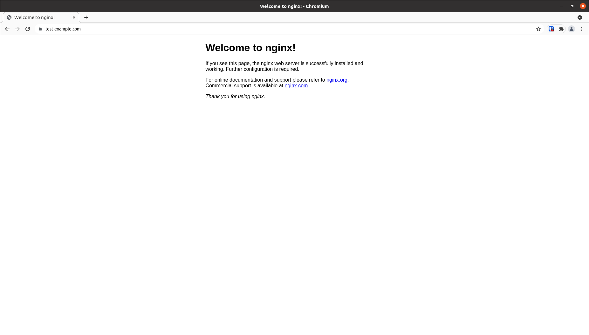
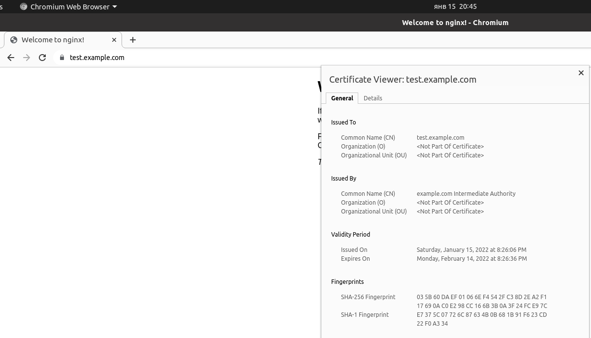
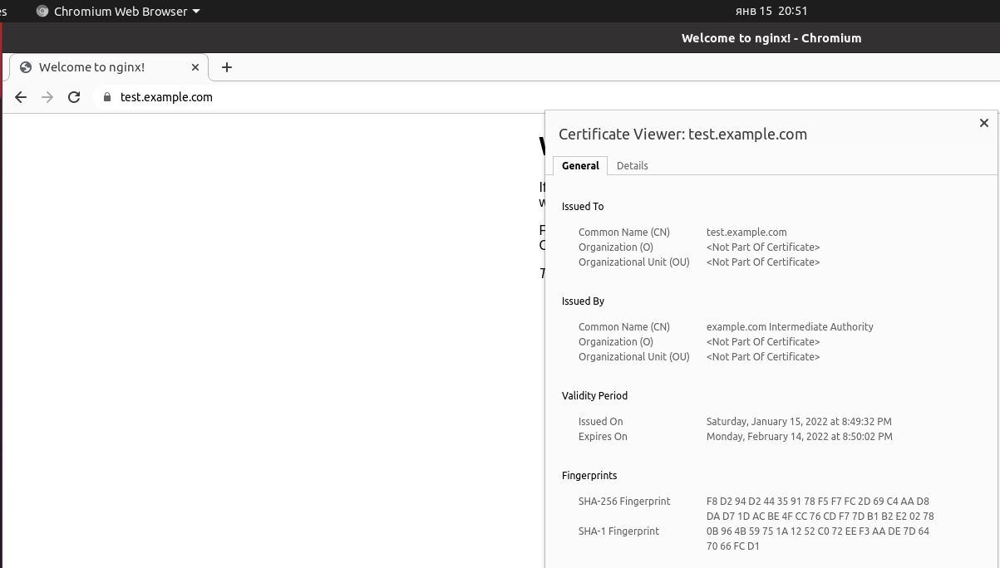

# Курсовая работа по итогам модуля "DevOps и системное администрирование"

Курсовая работа необходима для проверки практических навыков, полученных в ходе прохождения курса "DevOps и системное администрирование".

Мы создадим и настроим виртуальное рабочее место. Позже вы сможете использовать эту систему для выполнения домашних заданий по курсу

## Задание

1. Создайте виртуальную машину Linux.
2. Установите ufw и разрешите к этой машине сессии на порты 22 и 443, при этом трафик на интерфейсе localhost (lo) должен ходить свободно на все порты.
3. Установите hashicorp vault ([инструкция по ссылке](https://learn.hashicorp.com/tutorials/vault/getting-started-install?in=vault/getting-started#install-vault)).
4. Cоздайте центр сертификации по инструкции ([ссылка](https://learn.hashicorp.com/tutorials/vault/pki-engine?in=vault/secrets-management)) и выпустите сертификат для использования его в настройке веб-сервера nginx (срок жизни сертификата - месяц).
5. Установите корневой сертификат созданного центра сертификации в доверенные в хостовой системе.
6. Установите nginx.
7. По инструкции ([ссылка](https://nginx.org/en/docs/http/configuring_https_servers.html)) настройте nginx на https, используя ранее подготовленный сертификат:
  - можно использовать стандартную стартовую страницу nginx для демонстрации работы сервера;
  - можно использовать и другой html файл, сделанный вами;
8. Откройте в браузере на хосте https адрес страницы, которую обслуживает сервер nginx.
9. Создайте скрипт, который будет генерировать новый сертификат в vault:
  - генерируем новый сертификат так, чтобы не переписывать конфиг nginx;
  - перезапускаем nginx для применения нового сертификата.
10. Поместите скрипт в crontab, чтобы сертификат обновлялся какого-то числа каждого месяца в удобное для вас время.

## Результат

---

Добрый день!
Домашнее задание будет выполнено в виде ответов по пунктам
Ответы на вопросы выделены *курсивом*

---

- Процесс установки и настройки ufw

`sudo apt install ufw`

`sudo ufw disable`

`sudo ufw default deny incoming`

`sudo ufw default allow outgoing`

`sudo ufw allow 22`

`sudo ufw allow 443`

`sudo ufw allow in on lo`

`sudo ufw enable`

`sudo ufw status verbose`

```
Status: active
Logging: on (low)
Default: deny (incoming), allow (outgoing), disabled (routed)
New profiles: skip

To                         Action      From
--                         ------      ----
22                         ALLOW IN    Anywhere                  
443                        ALLOW IN    Anywhere                  
Anywhere on lo             ALLOW IN    Anywhere                  
22 (v6)                    ALLOW IN    Anywhere (v6)             
443 (v6)                   ALLOW IN    Anywhere (v6)             
Anywhere (v6) on lo        ALLOW IN    Anywhere (v6) 
```

- Процесс установки и выпуска сертификата с помощью hashicorp vault

*Установка*

`curl -fsSL https://apt.releases.hashicorp.com/gpg | sudo apt-key add -`

`sudo apt-add-repository "deb [arch=amd64] https://apt.releases.hashicorp.com $(lsb_release -cs) main"`

`sudo apt-get update && sudo apt-get install vault`

*Установка утилиты для работы с JSON*

`sudo apt-get install jq`

*Так как в данном примере VAULT запускается только для работы на локалхосте добавляем в файл конфигурации /etc/vault.d/vault.hcl следующий раздел*

```
# HTTP listener
listener "tcp" {
  address = "127.0.0.1:8200"
  tls_disable = 1
}
```
*Убираем раздел с HTTPS настройками, иначе возникает конфликт с nginx по 443 порту*

*Для сохранения сгенерированных ключей и сертификатов запускаем VAULT как системную службу*

`sudo systemctl enable vault`

`sudo systemctl start vault`

*Первоначальная настройка VAULT*

`export VAULT_ADDR='http://127.0.0.1:8200'`

`vault operator init`

*Данные из вывода команды сохраняем в файл с ключами /etc/vault.d/keys, файлу меняем овнера на root:root и атрибуты на 0600. Инструкция VAULT предполагает другой порядок хранения ключей для unseal и root token. Но в данном случае, для примера, мы будем делать автоматический unseal чтобы усложнить скрипт. Вся инфраструктура состоит из одного сервера, доступ к ключам имеет только root.*

`vault operator unseal <UNSEALKEY1>`

`vault operator unseal <UNSEALKEY>2`

`vault operator unseal <UNSEALKEY>3`

`unset VAULT_TOKEN`

`vault login <ROOTTOKEN>`

*Настраиваем VAULT для работы с инфраструктурой PKI и генерируем коревой самоподписный сертификат*

`vault secrets enable pki`

`vault secrets tune -max-lease-ttl=87600h pki`

`vault write -field=certificate pki/root/generate/internal common_name="example.com" ttl=87600h > CA_cert.crt`

`vault write pki/config/urls issuing_certificates="$VAULT_ADDR/v1/pki/ca" crl_distribution_points="$VAULT_ADDR/v1/pki/crl"`

*Генерируем промежуточный сертификат*

`vault secrets enable -path=pki_int pki`

`vault secrets tune -max-lease-ttl=43800h pki_int`

`vault write -format=json pki_int/intermediate/generate/internal common_name="example.com Intermediate Authority" | jq -r '.data.csr' > pki_intermediate.csr`

`vault write -format=json pki/root/sign-intermediate csr=@pki_intermediate.csr format=pem_bundle ttl="43800h" | jq -r '.data.certificate' > intermediate.cert.pem`

*Создаем роль в инфраструктуре для генерации конечного сертификата*

`vault write pki_int/roles/example-dot-com allowed_domains="example.com" allow_subdomains=true allow_bare_domains=true max_ttl="720h"`

*Генерируем сертификат для сайта test.example.com выгружаем в формате JSON*

`vault write -format=json pki_int/issue/example-dot-com common_name="test.example.com" ttl="720h" > test.example.com.crt.json`

*Создаем файлы, необходимые для работы nginx*

`cat test.example.com.crt.json | jq -r '.data.certificate' > test.example.com.pem`

`cat test.example.com.crt.json | jq -r '.data.ca_chain[]' >> test.example.com.pem`

`cat test.example.com.crt.json | jq -r '.data.private_key' > test.example.com.key`

- Процесс установки и настройки сервера nginx

`sudo apt install nginx`

*Создаем файл /etc/nginx/sites-enabled/test.example.com и удаляем из этой директории линк на дефолтный конфиг*

```
server {
    listen              443 ssl;
    server_name         test.example.com;
    ssl_certificate     ssl/test.example.com.pem;
    ssl_certificate_key ssl/test.example.com.key;
    ssl_protocols       TLSv1 TLSv1.1 TLSv1.2;
    ssl_ciphers         HIGH:!aNULL:!MD5;
    root /var/www/test.example.com;
    index index.html;
    location / {
        try_files $uri $uri/ =404;
    }
}
```

*Создаем файл index.html или берем дефолтный*

*Копируем сгенерированные файлы сертификата и ключа в каталог /etc/nginx/ssl*

*Задаем права на файлы сертификата и ключа*

`chmod 0600 {test.example.com.key,test.example.com.pem}`

`chown www-data:www-data {test.example.com.key,test.example.com.pem}`

*Ставим NGINX в автозапуск и рестартуем*

`systemctl enable nginx`

`systemctl restart nginx`

- Страница сервера nginx в браузере хоста не содержит предупреждений 



- Скрипт генерации нового сертификата работает (сертификат сервера ngnix должен быть "зеленым")

*Создаем следующий скрипт для генерации сертификата. Предполагается, что VAULT установлен локально, поэтому для примера делается автоматический unseal используя заранее сохраненный файл с ключами. В продакшене так делать не стоит.*

```bash
#!/usr/bin/env bash

# Redirect stdout to logger
exec 1> >(logger -s -t $(basename $0)) 2>&1

# Path to SSL cert files for nginx
CERTPATH="/etc/nginx/ssl"

# Path to file with unsale keys and root token. Format as after 'valut operator init' command.
KEYSF="/etc/vault.d/keys"

# TTL for generated cert
TTLCERT="720h"

# Site DNS name
SITENAME=$1

export VAULT_ADDR="http://127.0.0.1:8200"
unset VAULT_TOKEN

if [[ $SITENAME = "" ]]
then
    echo 'Need 1 arg with site DNS name'; exit 1
fi

if [[ $(vault status -format=json | jq -r '.initialized') != true ]]
then
    echo 'Error: Vault not initialized'; exit 1
fi

if [[ $(vault status -format=json | jq -r '.sealed') == true ]]
then
    UNSKEY1=$(grep "Key 1:" $KEYSF | awk '{print $4}')
    UNSKEY2=$(grep "Key 2:" $KEYSF | awk '{print $4}')
    UNSKEY3=$(grep "Key 3:" $KEYSF | awk '{print $4}')

    RTOKEN=$(grep "Root Token:" $KEYSF | awk '{print $4}')

    vault operator unseal $UNSKEY1 > /dev/null
    vault operator unseal $UNSKEY2 > /dev/null
    vault operator unseal $UNSKEY3 > /dev/null
    vault login $RTOKEN > /dev/null

fi

if [[ $(vault status -format=json | jq -r '.sealed') == true ]]
then
    echo 'Error: Vault sealed, cant unseal'; exit 1
else
    vault write -format=json pki_int/issue/example-dot-com common_name=$SITENAME ttl=$TTLCERT > $CERTPATH/$SITENAME.json
    
    if [[ $(cat $CERTPATH/$SITENAME.json | jq -r '.warnings' ) != null ]]
    then
    echo 'Error: Cant generate certificate request'; exit 1
    fi

    cat $CERTPATH/$SITENAME.json | jq -r '.data.certificate' > $CERTPATH/$SITENAME.pem
    cat $CERTPATH/$SITENAME.json | jq -r '.data.ca_chain[]' >> $CERTPATH/$SITENAME.pem
    cat $CERTPATH/$SITENAME.json | jq -r '.data.private_key' > $CERTPATH/$SITENAME.key

    chown www-data:www-data {$CERTPATH/$SITENAME.json,$CERTPATH/$SITENAME.pem,$CERTPATH/$SITENAME.key}
    chmod 0400 {$CERTPATH/$SITENAME.json,$CERTPATH/$SITENAME.pem,$CERTPATH/$SITENAME.key}

    systemctl stop nginx
    systemctl start nginx

    if [[ $? != 0 ]]; then echo 'Error: starting NGINX'; exit 1; fi

    echo 'New certificate for '$SITENAME' generated. NGINX restarted.'
fi
```

- Crontab работает (выберите число и время так, чтобы показать что crontab запускается и делает что надо)

*Редактируем crontab для юзера root*

`crontab -e`

*Создаем запись для запуска скрипта генереции сертификата, в нашем случае на запуск в 15:50 15.01*

`0 15 15 1 *	/etc/nginx/ssl/vaultreqcert test.example.com`




